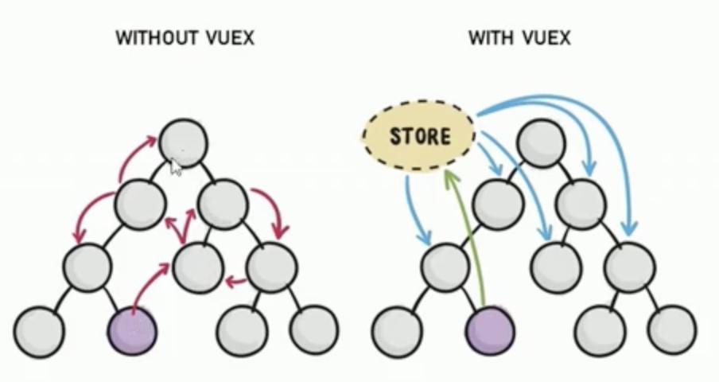

# vuex-learn

## Project setup
```
npm install
```

### Compiles and hot-reloads for development
```
npm run serve
```

### Compiles and minifies for production
```
npm run build
```

### Lints and fixes files
```
npm run lint
```

### Customize configuration
See [Configuration Reference](https://cli.vuejs.org/config/).

---

Vuex 是实现组件全局状态（数据）管理的一种机制，可以方便的实现组件之间数据共享



- 集中管理共享数据
- 高效实现组件之间数据共享
- vuex数据都是响应式的

- 什么数据适合存储到Vuex中
  - 组件之间共享的数据才有必要存储到vuex，私有数据存储在data中
    
- 安装包
  - npm install vuex --save
    
- 导入
  ```javascript
    import Vuex from 'vuex'
  ```

- .prettierrc
  代码格式处理
  ```text
    {
      "semi": false, # 不要分号
      "singleQuote": true # 单引号
    }
  ```
  

# Vuex 核心概念

## State
- State提供唯一的公共数据源，共享的数据都要统一放到Store的State中进行存储
## mutations
- mutations 用于变更State的数据
## Action
- action 用于处理异步任务
## Getter
- getter 不会修改store包装数据 自动更新